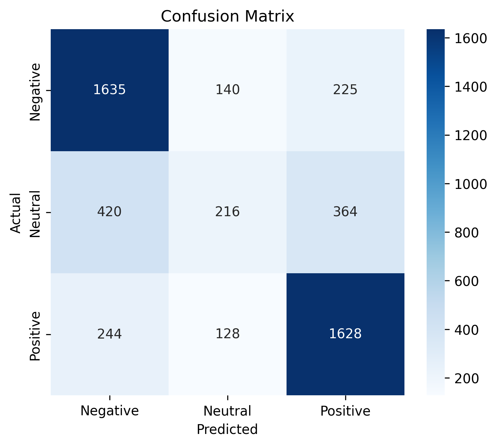
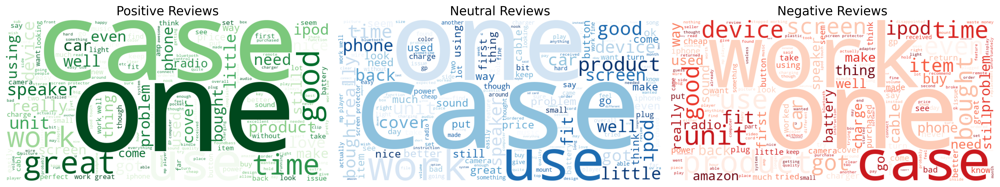
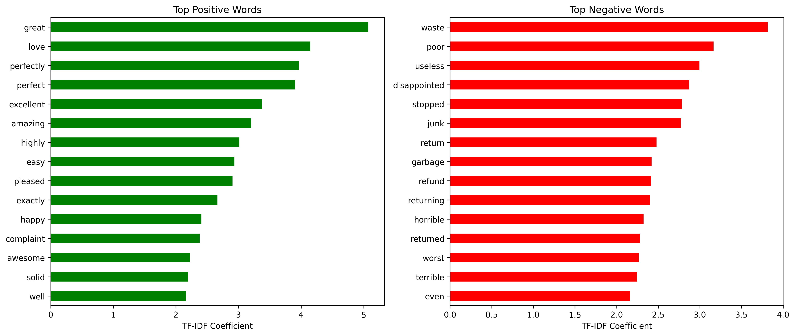

# 📦 Amazon Review Sentiment Analysis

A sentiment classification project using Natural Language Processing (NLP) to analyze 25,000 Amazon product reviews. The goal is to categorize each review as **Positive**, **Neutral**, or **Negative** using TF-IDF and Logistic Regression.

---

## 📌 Objectives

- Clean and preprocess real-world Amazon review data
- Convert raw text into numerical features using **TF-IDF**
- Build and evaluate a **Logistic Regression** classifier
- Visualize sentiment insights using **WordClouds**, **Confusion Matrix**, and **feature importance**

---

## 🗂️ Dataset Overview

- **Total Reviews:** 25,000  
- **Columns:** `reviews`, `sentiment` (ratings 1–5)  
- **Label Mapping:**  
  - 1–2 → Negative  
  - 3 → Neutral  
  - 4–5 → Positive

---

## 🧠 Model Summary

- **Vectorizer:** TF-IDF (top 5000 features)
- **Model:** Logistic Regression
- **Accuracy:** 69.58%
- **Macro F1-Score:** 61%

---

## 🔍 Confusion Matrix

Visual representation of classification performance.

---

## ☁️ Sentiment WordClouds

Most common words in **Positive**, **Neutral**, and **Negative** reviews.

---

## 📊 Top Words by Sentiment

Bar plot showing the top 15 influential words for Positive and Negative classes based on model coefficients.

---

## 📈 Key Insights

- The model performs well on clearly polar reviews
- Neutral sentiment is challenging due to overlap with positive/negative wording
- Frequent positive words: *great, love, excellent*  
- Frequent negative words: *waste, refund, disappointed*

---

## ⚠️ Limitations & Future Scope

| Limitation                    | Improvement                             |
|-------------------------------|------------------------------------------|
| No product-level tracking     | Add `product_id` for product-wise insights |
| Weak neutral classification   | Try SMOTE or advanced models like BERT  |
| Not deployed                  | Optionally deploy using Streamlit or Flask |

---

## 👨‍💻 Author

**Ashad K**  
📍 India | 💼 Open to opportunities in UAE 
📧 ashadakber32@gmail.com
🔗 [LinkedIn](https://www.linkedin.com/in/ashad-k)
🔗 [GitHub](https://github.com/Ashad777)  

---

## 🤝 Let’s Connect

If you're a recruiter, hiring manager, or fellow data professional, feel free to reach out. I'm actively seeking full-time roles in:

- 📊 **Data Analysis**  
- 📈 **Business Intelligence**  
- 🧠 **ML / AI Roles**  

Especially within the **UAE job market**.

---

⭐ If you found this project helpful, feel free to **star the repo** or connect with me!

## 📌 License

This project is intended for educational and portfolio use.

